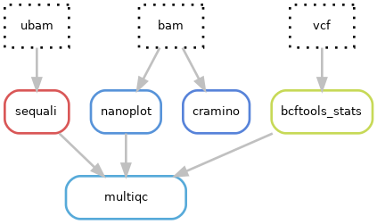

# Hydra-genetics qc module
The qc module is a collection of qc programs that performs analysis on the aligned bam-files as well as fastq-files and then collects these qc-measures in a html-report with MultiQC.

## QC programs

| Program | Input | Output |
|-|-|-|
| [fastqQC](https://github.com/s-andrews/FastQC) | fastq | Sequencing report |
| [GATK](https://gatk.broadinstitute.org/hc/en-us) | pileup | Sample contamination |
| [mosdepth](https://github.com/brentp/mosdepth) | bam | Coverage |
| [picard](https://broadinstitute.github.io/picard/) | bam | Alignment statistics, gc bias, panel statistics, insert size |
| [rseqc](https://rseqc.sourceforge.net/) | bam | RNA gene coverage and inner distance |
| [samtools](http://www.htslib.org/doc/samtools-stats.html) | bam | Alignment statistics |
| [peddy](http://www.htslib.org/doc/samtools-stats.html) | vcf | Sex and relatedness checks |
| [verifybamid2](https://github.com/Griffan/VerifyBamID) | bam | Sample contamination estimate |
| [multiQC](https://github.com/ewels/MultiQC) | QC-files | Summary html-report |

## CNV_SV short read steps

## DNA Pacbio steps

## Module input files
The QC programs operate mostly on mapped and unmapped bam files but also fastq and vcf files.

* `alignment/samtools_merge_bam/{sample}_{type}.bam`
* `alignment/star/{sample}_R.bam`
* `prealignment/merged/{sample}_{type}_fastq1.fastq.gz`
* `prealignment/merged/{sample}_{type}_fastq2.fastq.gz`
* `qc/peddy/all.vcf.gz`

## Module output files
The QC measures are reported in a MultiQC html report. The report can be split up depending on for example sample type being DNA or RNA.

* `qc/multiqc/multiqc_{report}.html`

#### Example output
* `qc/multiqc/multiqc_DNA.html`
* `qc/multiqc/multiqc_RNA.html`